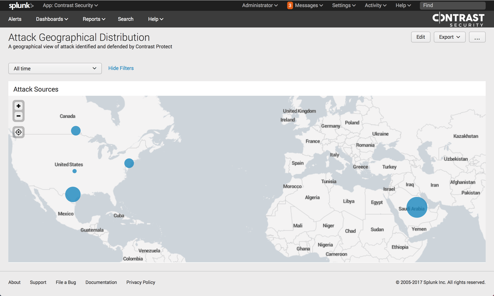

# Contrast Security App for Splunk

Contrast Security App for Splunk allows you to visualize the security of your running application like never before. Contrast Security App for Splunk provides actionable and timely application threat intelligence across your entire application portfolio. Contrast Security instrumented applications self-report the following about an attack – the attacker’s IP address, authenticated username, method of attack, which applications, servers, frequency, volume, and level of compromise. In addition, Contrast Security also provides specific guidance to engineering teams on where applications were attacked and how threats can be remediated. Finally, Contrast Security's Log Enhancement capability extends this visibility into the inner workings of application and user behavior.  Log Enhancers enable users to log anything in an application.
 
All of this intelligence is streamed directly into Splunk, allowing you to quickly and efficiently identify key problem areas and respond to attacks faster than ever before.
 
  
 ## Installation Instructions

 ### 1. Install Contrast Security App

 * Download the packaged app from Splunk marketplace or GitHub.
 * Click the Settings gear icon next to Apps
 * Click install app from file.

 ### 2. Setup syslog receiver

   Contrast Security agents stream SIEM events as UDP syslog events in CEF format. 

 * Click on Settings -> Data Input
 * Add new UDP listener

   Reuse port 514 or chose a different port
 
   Select source_type as contrast_events
 

## Dashboards
The default dashboard looks like this ...

We also show geographical view of attack sources. The charts are all drill-down charts.

## Reports
All events reported by Contrast Security.

## Search
Contrast Security adds a new event type. You can customize the search using Splunk query language.

 
 ## Developer Instructions

To learn how to write an app for Splunk, please refer to [Splunk Website](http://dev.splunk.com/view/webframework-developapps/SP-CAAAEMY).